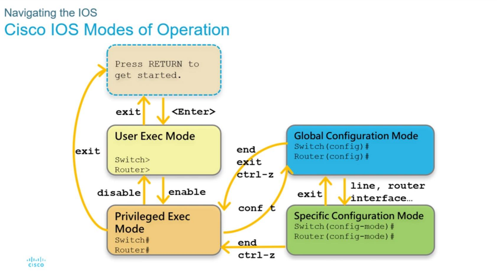

# 通訊與網路概論

## SISCO router 設定

### 指令目錄
<a href="#※-通用指令">通用指令</a> - <a href="#※-設定ip">設定ip</a> - <a href="#※-設定靜態路由ip">設定靜態路由ip</a> - <a href="#※-設定DGW">設定DGW</a> - <a href="#※-儲存狀態指令">儲存狀態指令</a>

### ※ 通用指令
| 指令   | 模式 | 解釋                                     |
| ------ | ---- | ---------------------------------------- |
| enable | >    | 進入Privileged Mode[#]                   |
| conf t | #    | 進入Global Configuration Mode[(config)#] |

### ※ 設定ip
| 指令               | 模式         | 解釋                        |
| ------------------ | ------------ | --------------------------- |
| interface [port]   | (config)#    | 進入Specific Interface Mode |
| ip add [ip] [mask] | (config-if)# | 設定interface的ip和mask     |
| no shutdown        | (config-if)# | 儲存設定                    |

### ※ 設定靜態路由ip
| 指令                             | 模式      | 解釋                       |
| -------------------------------- | --------- | -------------------------- |
| ip route [fIp網段] [fMask] [tIp] | (config)# | 目標fIp網段的封包，丟向tip |

### ※ 設定OSPF
| 指令                                    | 模式             | 解釋                                  |
| --------------------------------------- | ---------------- | ------------------------------------- |
| router ospf [ProcessId]                 | (config)#        | 進入touter Mode(ProcessId設1)         |
| network [ip網段] [反向mask] area [area] | (config-touter)# | 設定OSPF IP (直連的都要設定，area設0) |

### ※ 設定DGW
| 指令                    | 模式      | 解釋    |
| ----------------------- | --------- | ------- |
| ip default-gateway [ip] | (config)# | 設定DGW |

### ※ 儲存狀態指令
| 指令                               | 模式 | 解釋                     |
| ---------------------------------- | ---- | ------------------------ |
| sh running-config                  | #    | 儲存設定到running-config |
| copy running-config startup-config | #    | 儲存設定到startup-config |
| show ip route                      | #    | show route table         |